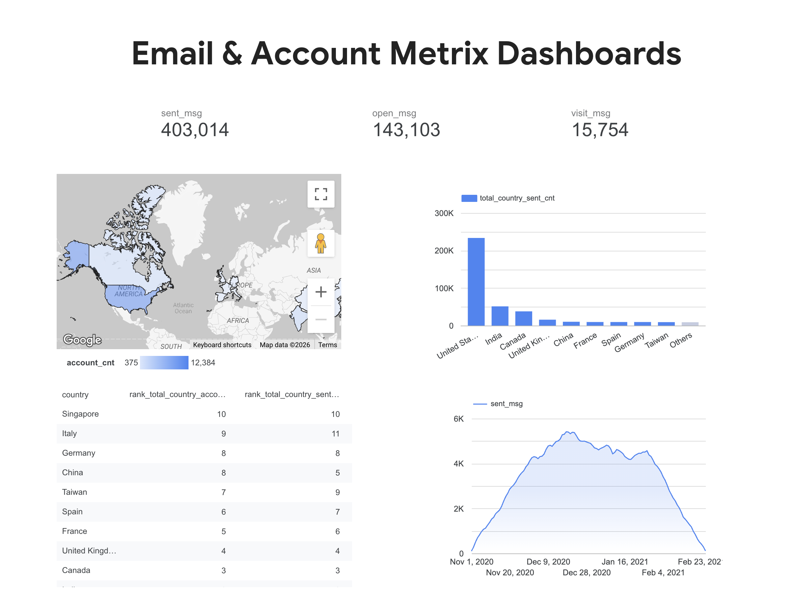

# SQL Email & Account Metrix Analysis
In this project, I collected data that helped analyze trends in account creation and user activity related to emails (sends, opens, clicks), as well as assess behavior across categories such as sending intervals, account verification, and subscription status. The data allowed me to compare activity across countries, identify key markets, and segment users by various parameters.
## Tech Stack & Database
* Database: Google BigQuery
* SQL Features Used: CTEs (`WITH` clause), Data Integration (`UNION ALL`), Window Functions (`SUM OVER`, `DENSE_RANK`), Multi-table `JOIN`s, Group Aggregations.
## Dashboard Preview 

